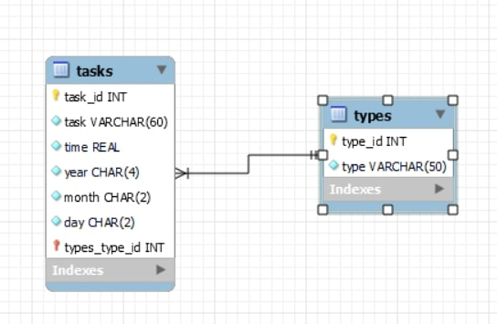

# SQL Database With Python

This is my **SQL Database in Python Demo** software. I decided to make this demo to research, gain an understanding of, and showcase my understanding in using SQL in python to create a database and be able to access and modify it using queries. To do this, I created a planner that can store and modify data entered by the user.

Some of the commands I use in the queries are:

* CREATE
* INSERT
* SELECT
* UPDATE
* DELETE
* CONCAT
* ORDER BY
* INNER JOIN
* DATE (%m/%d/%Y)

[Software Demo Video](http://youtu.be/P3rYR_V8G-s)

## Relational Database

The relational database that I am using is SQLite3, which is already included in the default python libraries.

The database has two tables, one named **tasks** and one named **types**. Tasks contains the task_id, task, year, month, day, and time. Types contains the type_id, and type. Using an **INNER JOIN**, I am able to do **SELECT** queries that use the type_id to get the type name, and display it to the user. The database is structured as shown below:

## Development Environment

I used Visual Studio Code with python to create this project, and used the built in SQLite3 library to create and query the database.

### Tools

* Visual Studio Code
* Python
* SQLite3

## Useful Websites

* [SQLite Tutorial](http://www.sqlitetutorial.net/)
* [Python Homepage](http://www.python.org/)
* [W3 Schools](http://www.w3schools.com/sql/)

## Future Work

* Make program appear in a window
* Add more items to be input so I can use more tables to help with practice
* Create a new database that can work with a game